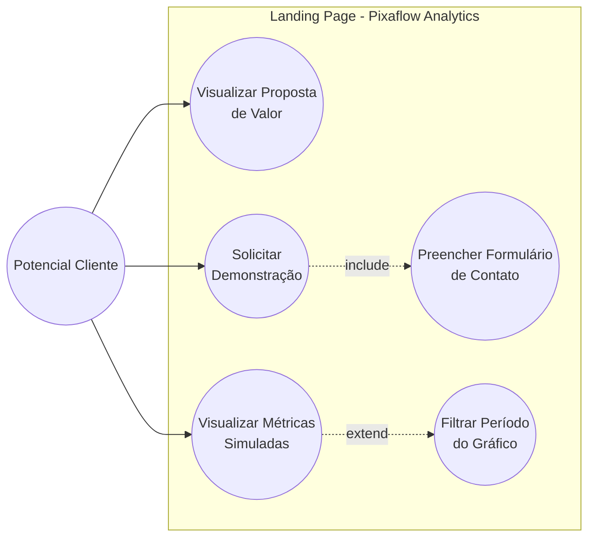

# Pixaflow Analytics

## 1. Casos de uso

```mermaid
graph LR
    ator(("Potencial Cliente"))

    subgraph LP["Landing Page - Pixaflow Analytics"]
        UC1(("Visualizar Proposta<br/>de Valor"))
        UC2(("Visualizar Métricas<br/>Simuladas"))
        UC3(("Solicitar<br/>Demonstração"))
        UC4(("Preencher Formulário<br/>de Contato"))
        UC5(("Filtrar Período<br/>do Gráfico"))
    end

    ator --> UC1
    ator --> UC2
    ator --> UC3

    UC3 -. include .-> UC4
    UC2 -. extend .-> UC5
```
