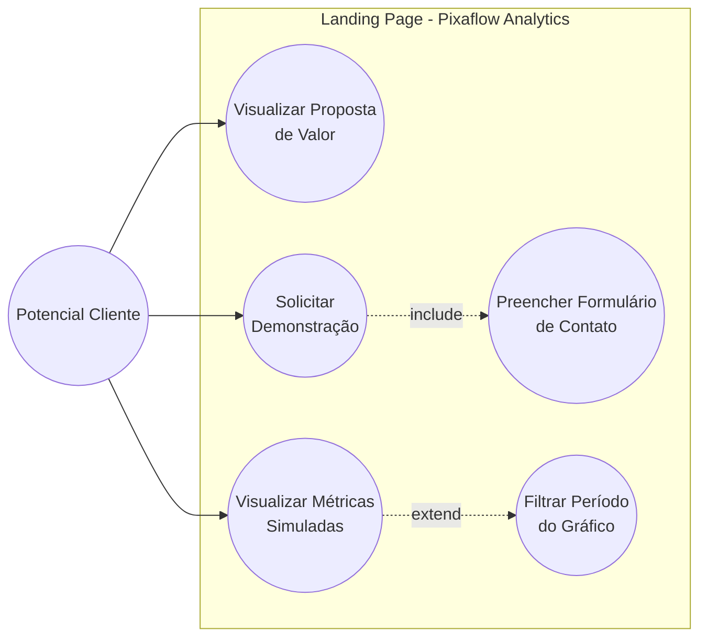

# 📊 Pixaflow Analytics - Landing Page

Uma landing page profissional e minimalista desenvolvida para apresentar a ferramenta de dashboard de análise de métricas da Pixaflow. O projeto inclui visualização de dados interativa consumindo um arquivo JSON local.

## 🚀 Tecnologias Utilizadas

* **HTML5:** Estrutura semântica e limpa.
* **Tailwind CSS:** Estilização visual (via CDN) com design tokens oficiais da marca (Dark Mode).
* **JavaScript (Vanilla):** Lógica de consumo de dados (Fetch API) e manipulação do DOM.
* **Chart.js:** Renderização do gráfico interativo (Line Chart) do dashboard.

## ⚙️ Pré-requisitos

Para rodar este projeto localmente, você precisará apenas de:

1. Um navegador web moderno (Google Chrome, Firefox, Edge, etc.).
2. **Python 3** instalado em sua máquina (já nativo na maioria das distribuições Linux).

# 🏃 Como rodar o projeto

Como o projeto faz uma requisição HTTP via JavaScript (`fetch('dados.json')`) para carregar os dados do gráfico, é necessário rodar um servidor local simples para evitar bloqueios de segurança (CORS) do navegador.

1. Abra o terminal e navegue até a pasta raiz do projeto:
   ```bash
   cd caminho/para/a/sua/pasta/LandingPage
   ```
2. Inicie o servidor local embutido do Python:
   ```bash
   python3 -m http.server 8000
   ```

3. Abra o seu navegador e acesse a seguinte URL:
   ```text
   http://localhost:8000
   ```

## 📁 Estrutura do Projeto

* `index.html`: Arquivo principal contendo a estrutura da página (Header, Hero Section e Container do Dashboard).
* `dados.json`: Contrato de dados fictícios contendo as métricas mensais (volume de chamados e tempo de resposta) consumidas pelo gráfico.
* `README.md`: Documentação atual do projeto.
   
# Casos de uso

